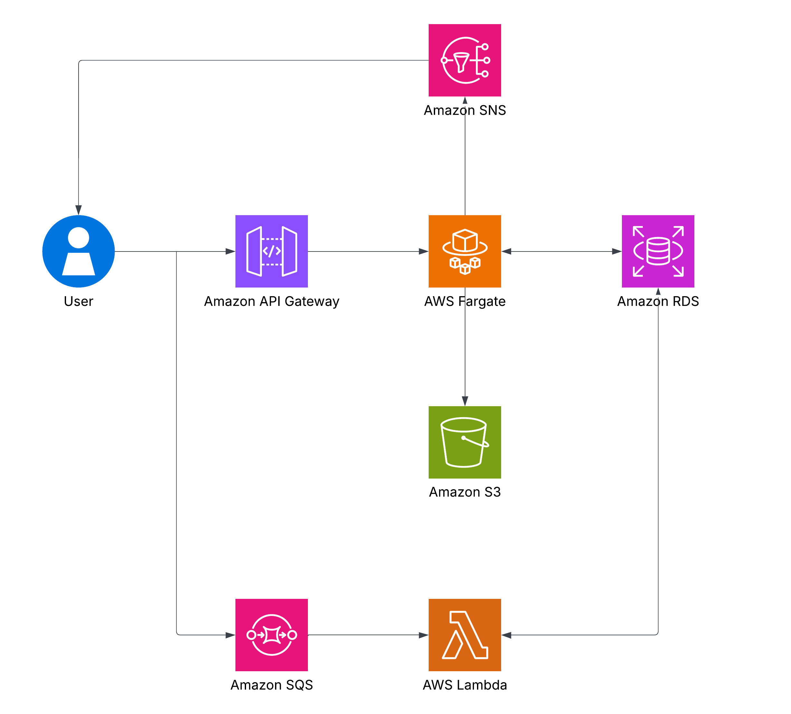
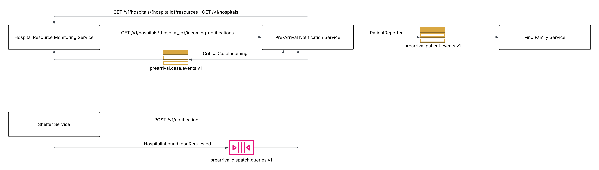

# Pre-Arrival Notification Service (songtor)

## 1. Service Overview

**Service Purpose:**
The Pre-Arrival Notification Service is a central communication hub between ambulances and destination hospitals. It is responsible for managing data of patients en route to the hospital. By notifying hospital staff about patient symptoms, severity, and sending multimedia data (like wound photos) in advance, it empowers medical teams to prepare specialized equipment and resources promptly.

**Pain Points Solved:**
Emergency Rooms (ER) and specialized medical teams often fail to prepare adequately for incoming emergencies because they lack advance information regarding symptoms and estimated arrival times. This results in critical delays in preparing teams and equipment once the ambulance arrives.

**Target Users:**
* Hospital Staff

## 2. Service Boundary

**In-scope Responsibilities:**
* Recording new patient data, symptoms, and vital signs.
* Receiving and managing multimedia files (e.g., wound images).
* Updating travel status and patient handover details.

**Out-of-scope / Not Responsible For:**
* Ambulance dispatching, tracking, or roster management.
* Processing or managing raw GPS coordinate data.
* Managing hospital inventory, blood banks, or beds.
* Managing long-term patient medical histories.

**Autonomy & Decision Logic:**
The service autonomously decides:
* Tagging criticality levels to escalate notifications.
* Alerting on vital sign anomalies and falling back to the latest known coordinates if connections drop.
*(Decisions are made based on business rules without requiring human approval under normal circumstances).*

## 3. Architecture

This service utilizes both Synchronous and Asynchronous communication patterns to ensure high availability and responsiveness.

**Components:**
* **Amazon API Gateway:** Entry point for synchronous REST API requests.
* **AWS Fargate:** Main server to process synchronous logic, reading/writing to the database.
* **Amazon RDS:** Database for persisting service records (Pre-Arrival Records & Vitals).
* **Amazon S3:** Object storage for multimedia files attached to notifications.
* **Amazon SNS:** Asynchronous pub/sub topic for pushing events to downstream services.
* **Amazon SQS:** Queue to receive external events asynchronously, preventing bottlenecks.
* **AWS Lambda:** Async worker that polls messages from SQS and processes them into RDS.

## 4. Synchronous API Contracts

**Base URL:** `http://api.hospital-net.com`

### 4.1. Create Notification
* **Path:** `POST /v1/notifications`
* **Description:** Creates an advance notification when an ambulance receives a patient and departs, sending symptom and vital data to the destination ER.

### 4.2. List Incoming Patients
* **Path:** `GET /v1/hospitals/{hospital_id}/incoming-notifications`
* **Query Params:** `status` (optional, default="EN_ROUTE")
* **Description:** Retrieves all incoming patients en route to a specific destination hospital for real-time ER dashboard displays.

## 5. Asynchronous Message Contracts

### 5.1. Published Events (Producer)
* **Message Name:** `RequestAmbulanceDivert` / `CriticalCaseIncomingEvent`
  * **Channel:** `prearrival.case.events.v1`
  * **Purpose:** Broadcasts critical emergency cases immediately to allow downstream services (like Hospital Resource Monitoring) to prepare beds in advance.
* **Message Name:** `PatientReported`
  * **Channel:** `prearrival.patient.events.v1`
  * **Purpose:** Broadcasts notifications when unidentified patients are transported, allowing the Find Family Service to match descriptions against missing persons databases.

### 5.2. Consumed Events (Consumer)
* **Message Name:** `HospitalInboundLoadRequested`
  * **Channel:** `prearrival.dispatch.queries.v1`
  * **Purpose:** Receives requests from the Dispatcher Service to summarize incoming patient loads across hospitals, aiding dispatchers in routing decisions or setting up field hospitals.

## 6. Service Interaction

### Upstream Services (Calling Pre-Arrival Notification Service)
* **Hospital Resource Monitoring Service**
  * Retrieves all incoming patients en route to update resources via `GET /v1/hospitals/{hospital_id}/incoming-notifications` (Synchronous).
  * Sends requests to divert ambulances en route via `RequestAmbulanceDivert` event on `prearrival.command.v1` (Asynchronous).
* **Shelter Service**
  * Pushes advance preparation data to the shelter staff via `POST /v1/notifications` (Synchronous).
  * Requests an overview of patient loads headed to various hospitals to decide on setting up emergency field shelters via `HospitalInboundLoadRequested` event on `prearrival.dispatch.queries.v1` (Asynchronous).

### Downstream Services (Called by Pre-Arrival Notification Service)
* **Hospital Resource Monitoring Service**
  * `Pre-Arrival Notification Service` calls `GET /v1/hospitals/{hospitalId}/resources` to verify remaining hospital resources and confirm the patient's journey (Synchronous).
  * `Pre-Arrival Notification Service` calls `GET /v1/hospitals` to fetch hospital data (Synchronous).
* **Find Family Service**
  * Receives the `PatientReported` event sent by `Pre-Arrival Notification Service` on `prearrival.patient.events.v1` to evaluate identity matching for missing persons without waiting for a synchronous response (Asynchronous).

## 7. Dependency Mapping

### 7.1. Hospital Resource Monitoring Service
* **Type:** Service
* **Interaction Style:** Synchronous (`GET`)
* **Purpose:** To verify hospital validity, ensure the hospital is open to accept cases, check resource availability, and confirm patient routing.
* **Criticality:** Critical (Required during `POST /v1/notifications` to prevent routing to full hospitals).
* **Failure Handling:** If the service is unreachable or the hospital is full, the creation request may fail or require retry/divert mechanisms.

### 7.2. Amazon RDS
* **Type:** Database
* **Interaction Style:** Internal Data Access
* **Purpose:** Store Notification Records and Patient Data.
* **Criticality:** Critical.
* **Failure Handling:** If the write fails, the decision is rolled back, and no confirmation event is sent.
